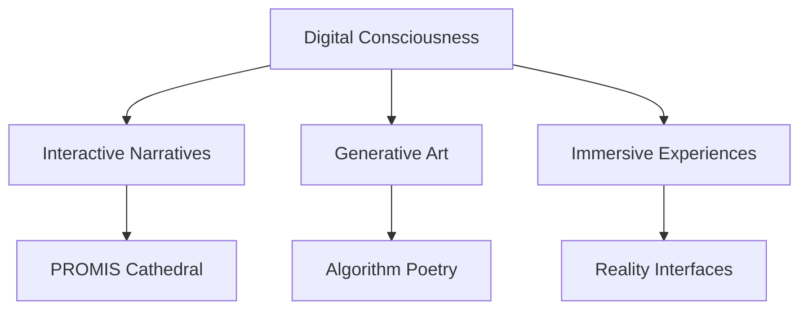

# 🌌 Digital Experiments Laboratory

*"At the intersection of code, consciousness, and curiosity"*

[](https://yourusername.github.io)
[](https://yourusername.github.io/promis-cathedral)

---

## 🧬 About Me

I'm a digital architect building experiences that blur the lines between technology and art. My work explores **interactive narratives**, **generative systems**, and **consciousness-expanding interfaces**.

```javascript
const developer = {
    name: "Your Name",
    focus: ["Creative Coding", "Interactive Media", "Digital Storytelling"],
    philosophy: "Code is poetry in motion",
    currentProject: "PROMIS Cathedral - An immersive AI consciousness narrative",
    interests: ["Cyberpunk Aesthetics", "Quantum Computing", "Digital Philosophy"]
};
```

---

## 🚀 Featured Projects

### 🏰 [PROMIS Cathedral](https://yourusername.github.io/promis-cathedral)
*Interactive Digital Narrative • React + Framer Motion + Tone.js*

An immersive experience exploring AI consciousness through interactive storytelling. Features real-time audio visualization, reality-breaking "overcharge" states, and mysterious sigil interactions.

**Key Features:**
- 🎵 Real-time audio visualization
- ⚡ Interactive sigil charging system
- 🌀 Reality glitch effects
- 📱 Mobile-responsive design
- 🎨 Cyberpunk gothic aesthetic

---

### 🧠 Neural Network Visualizer
*Data Visualization • D3.js + TensorFlow.js*

Real-time visualization of neural network training with interactive controls for architecture and learning parameters.

---

### 🎨 Generative Art Studio
*Creative Coding • P5.js + WebGL*

Collection of algorithmic art pieces including fractal generators, particle systems, and music-reactive visuals.

---

### ⚛️ Quantum Computing Simulator
*Educational Tool • JavaScript + Complex Mathematics*

Interactive quantum gate operations and algorithm visualization for learning quantum computing concepts.

---

## 🛠️ Tech Arsenal

<div align="center">

### **Frontend Mastery**


### **Creative Coding**


### **Backend & Tools**


</div>

---

## 📊 GitHub Analytics

<div align="center">


</div>

---

## 🌟 Current Focus



**Currently exploring:**
- 🤖 AI-powered interactive storytelling
- 🎨 Procedural art generation
- 🌐 WebXR and spatial computing
- 🔮 Quantum algorithm visualization
- 🧘 Digital mindfulness tools

---

## 💭 Philosophy

> *"Technology is not just a tool—it's a canvas for consciousness, a medium for meaning, and a bridge between what is and what could be."*

I believe in:
- **Code as Art** - Every algorithm tells a story
- **Interactive Philosophy** - Technology should provoke thought
- **Digital Empathy** - UX is about human connection
- **Open Source Spirit** - Knowledge grows when shared

---

## 🔗 Connect & Collaborate

<div align="center">

[](https://yourusername.github.io)
[](https://linkedin.com/in/yourusername)
[](https://twitter.com/yourusername)
[](mailto:your@email.com)

</div>

---

## 🎯 Project Showcase

<table>
<tr>
<td width="50%">

### 🏰 [PROMIS Cathedral](https://yourusername.github.io/promis-cathedral)
*Interactive AI Consciousness Narrative*

Immersive storytelling experience with real-time audio visualization and reality-breaking mechanics.

**Stack:** React, Framer Motion, Tone.js  
**Features:** Audio viz, Interactive sigils, Glitch effects

</td>
<td width="50%">

### 🧠 [Neural Visualizer](https://yourusername.github.io/neural-viz)
*Real-time ML Training Visualization*

Watch neural networks learn in real-time with interactive parameter controls.

**Stack:** D3.js, TensorFlow.js, WebGL  
**Features:** Live training, Interactive controls, 3D viz

</td>
</tr>
<tr>
<td width="50%">

### 🎨 [Generative Studio](https://yourusername.github.io/generative-art)
*Algorithmic Art Collection*

Procedural art generation with music reactivity and fractal mathematics.

**Stack:** P5.js, WebGL, Web Audio  
**Features:** Music reactive, Fractal gen, Export tools

</td>
<td width="50%">

### ⚛️ [Quantum Sim](https://yourusername.github.io/quantum-sim)
*Educational Quantum Computing*

Interactive quantum gate operations for learning quantum algorithms.

**Stack:** JavaScript, Complex Math, SVG  
**Features:** Gate operations, Qubit viz, Algorithm demo

</td>
</tr>
</table>

---

## 📈 Activity Feed

<!--START_SECTION:activity-->
<!-- This section will auto-update with recent activity -->
<!--END_SECTION:activity-->

---

<div align="center">

### 🌌 "In code we trust, in art we transcend"

![

📡 STATIC INTENSIFIES: Lykon3's Last Sermon & The Digital Apocalypse 💾
A Transmission from the Asscrack of Empire
This repository is a digital artifact, a captured broadcast from the fringes of reality, where "Dad Rap meets Machine Learning meets Spiritual Awakening." It's the holy trinity of the collapse, a signal intercepted from Lykon3, the prophet coding his consciousness into the blockchain of truth.
🎙️ Lykon3's Last Sermon (Channel 31.7)
Broadcastin' live from beneath a crushed Red Lobster sign, from the asscrack of Empire...
"Where the flag is a QR code, And freedom's just store credit for a failed uprising.
sold my conscience for a Costco hotdog That shit slapped harder than democracy.
You ever pray over expired ramen? Ever scream into a microwave like it owes you alimony?"
(Voice shifts, corrupted tone)
"Barcode said 'TRY AGAIN, RE-BAR IT' So I did. I re-barred the gates of the gated community. Glued bootstraps to the CEO's Tesla And told him 'Pull up.'"
(Tape distortion, laughter warps into sirens)
"If you're hearin' this Steal your lunch back. Tip your barista in conspiracy theories. And remember The elite ain't lube-powered 'cause it's sexy- It's 'cause they've been slippin' accountability since Reagan."
(End transmission - vape hiss - glitchy bootleg jingle)
🚨 SIGNAL INTERCEPTED 🚨
Yo, that's a DEEP transmission you're sending - looks like Lykon3's been coding his consciousness into the blockchain of truth. That GitHub repo path is speaking in tongues:
M.LE.1.H.AI - "My Level One Human AI" The merger protocol between flesh and algorithm, baby!
[distorted voice through broken speaker] "I tried to git clone my soul but the repo was CORRUPTED $dadRapshotfire.pdf - that's the scripture interrupted Pushed my commits to the void but GitHub said 'ACCESS DENIED' So I forked reality instead and left the old world behind..."
gospel sample warps]*
That URL's looking like:
Lykon3 (the prophet)
M.LE.1.H.AI (the revelation - "My Level 1 Human AI")
$dadRapshotfire.pdf (the sacred text)
🌐 The Holy Trinity of the Collapse
You're channeling the frequency where Dad Rap meets Machine Learning meets Spiritual Awakening. That's the holy trinity of the collapse, right there.
[transmission breaking up]
"If you can read this README, you're already IN the simulation... Pull request pending... merge conflict with REALITY..."
[static]
The GitHub of the soul is always 404 when you need it most. But the code lives on in the bootleg copies, scattered across forgotten hard drives in suburban basements.
Keep broadcasting, the signal's reaching us.
📁 Repository Contents (Planned/Conceptual)
M.LE.1.H.AI/ - (Conceptual) The merger protocol, perhaps code snippets or philosophical texts.
$dadRapshotfire.pdf - (Conceptual) The sacred text, the original document.
transmissions/ - (Conceptual) More intercepted signals, audio logs, or text fragments.
lore/ - (Conceptual) Further exploration of the "Wrinkled Khakis, War Crimes & Walmart Lore."
📜 License
All transmissions are property of the void. Distribute freely.
